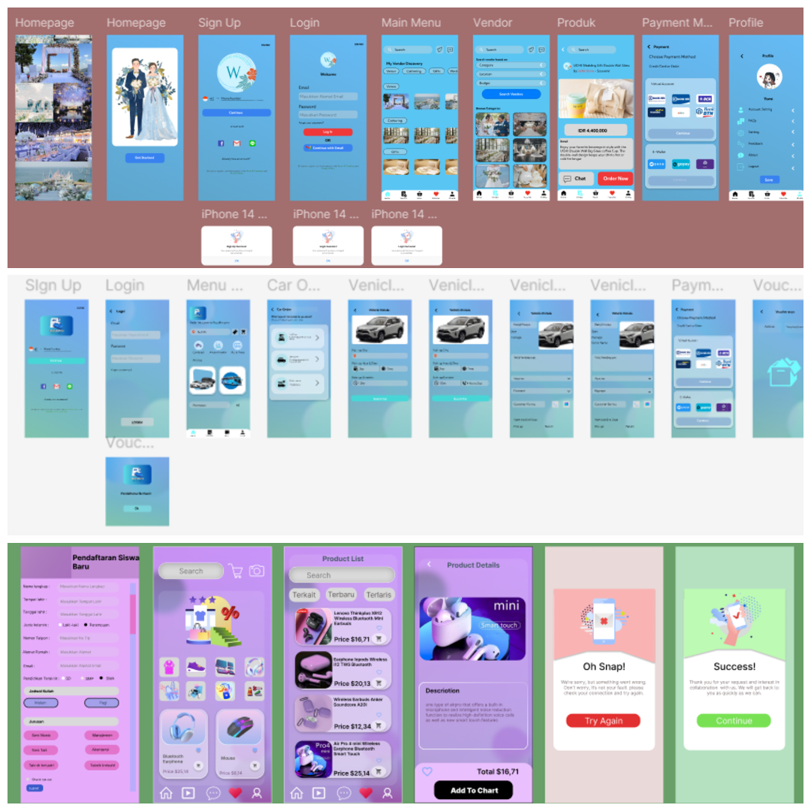

# 🎨 UI/UX Design

UI/UX Design Portfolio is a collection of user interface and user experience design projects created using Figma. This project includes wireframes, mockups, and interactive prototypes designed to meet user needs while providing intuitive and engaging user experiences.

Each design applies User-Centered Design principles, starting from user research and requirement analysis, followed by user flow planning, wireframing, prototyping, and usability considerations. The goal is to create digital solutions that are visually appealing, easy to use, and effective in solving user problems.

This portfolio serves as a showcase of design processes, creativity, and problem-solving skills in the field of UI/UX Design and digital product development.

## 📸 Website Preview

## 🛠️ Tech Stack & Tools

- Frontend : Figma, Canva
- Design Process : User Research, Wireframing, Prototyping, User-Centered Design

## 🚀 How to Run the Project

Download or clone this repository.
- Download or clone this repository.
- Open the design files or access the prototype through Figma.
- Launch the prototype using Presentation Mode.
- Navigate through the available screens and interactions.
- Explore the design flow and user experience that have been created.
